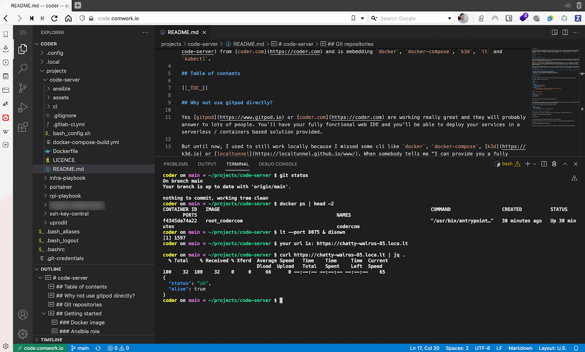

# code-server

Yet another "gitpod like environment" you can install directly self-host on your own infrastructure and with the real tools you're using locally everyday. The docker image is inheriting [this one](https://hub.docker.com/r/codercom/code-server) from [coder.com](https://coder.com) and is embedding `docker`, `docker-compose`, `k3d`, `kubectl`, `kubeseal`, `k9s`, `helm`, `terraform`, `terragrunt`, `ansible`, `gcloud`, and `lt`.



## Table of contents

[[_TOC_]]

## Why not use gitpod directly?

Yes [gitpod](https://www.gitpod.io) or [coder.com](https://coder.com) are working really fine and they will probably answer to lots of people. You'll have your fully fonctional web IDE and you'll be able to deploy your services in a serverless / containers based solution provided.

But until now, I used to still work locally because I missed some cli like `docker`, `docker-compose`, [k3d](https://k3d.io), [k9s](https://k9scli.io), [localtunnel](https://localtunnel.github.io/www/), `jq`, `yq`. When somebody tells me "I can provide you a fully complete developer|ops local environment on the cloud, you'll just have to use a browser", I expect all my everyday tools to be there. I also expect to be able to clone and run any projects I want it with only one limitation: the chosen sizing of my instance (like I had a limit size on my laptop before).

So this is why this alternative exists: you'll have my dream dev environment on the cloud (with all those common CLI) and if OCI containers aren't sufficient for you, you'll also be able to install the missed dependancies you need directly on the terminal.

That's also why we're working on providing a [SaaS version](https://code.comwork.io).

## Git repositories

* Main repo: https://gitlab.comwork.io/oss/ansible-iac/code-server
* Github mirror: https://github.com/idrissneumann/code-server.git
* Gitlab mirror: https://gitlab.com/ineumann/code-server.git
* Bitbucket mirror: https://bitbucket.org/idrissneumann/code-server.git

## Getting started

### Docker image

The image is available on docker hub [here](https://hub.docker.com/repository/docker/comworkio/code-server).

Very simple example with docker-compose:

```yaml
version: "3.3"

services: 
  code-server:
    image: comworkio/code-server
    container_name: code-server
    network_mode: host
    volumes:
      - ./code-config.yaml:/home/coder/.config/code-server/config.yaml:z
      - /var/run/docker.sock:/var/run/docker.sock
```

And the `code-config.yaml` :

```yaml
bind-addr: 0.0.0.0:8080
auth: password
password: changeit
cert: false
```

Then you can add volum with your workspaces git repositories.

### Ansible role

You can automate your workspaces on a classic VM or compute instance using this [ansible role](./ansible/roles/code) which supports CentOS with docker and docker-compose installed.

You'll just have to complete this yaml repository inventory:

```yaml
code_git_workspaces:
  - name: code-server
    git: https://gitlab.comwork.io/oss/code-server.git
```

### Expose your containers with localtunnel

You can expose your containers on internet using [Localtunnel](https://localtunnel.github.io/www/)

For example if you want to expose the 8080 port:

```shell
lt --port 8080
```

You containers will have to map the same tcp port on the local network.

You can also use the comwork.io instance of server tunnels if you've been authorized by comwork this way:

```shell
lt --port 8080 $COMWORK_LOCAL_TUNNEL_SERVER
```

Either way, you'll get an url as output that you'll be able to share with other people arround the world !
